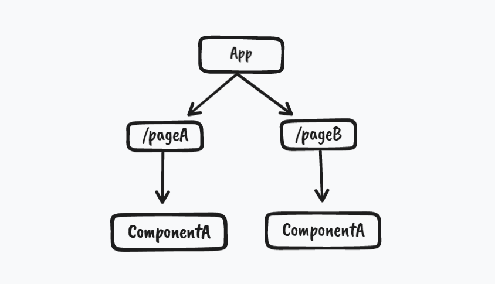
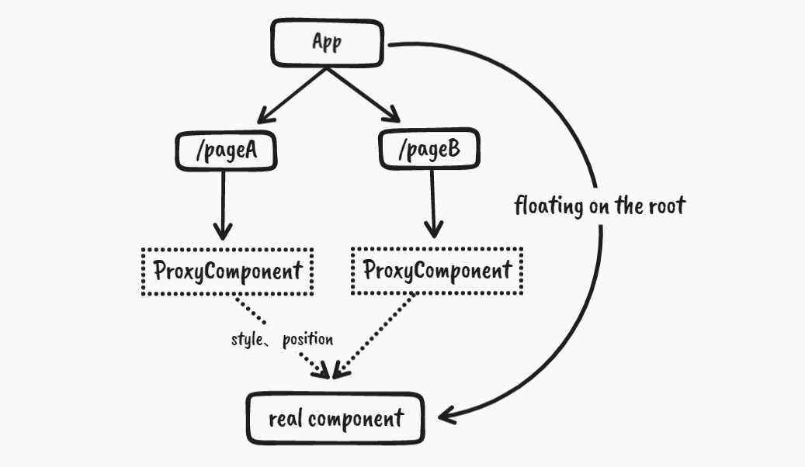

<br>
<p align="center">
Shared React component across routes with animations 
</p>
<p align="center"><a href="https://friendly-paletas-0b8746.netlify.app/">Live Playground</a></p>
<p align="center">
Inspired by <a href="https://github.com/antfu/">Antfu</a>
</p>
<p align="center">English | <a href="./README.zh.md">简体中文</a></p>
<br>

## Why
We usually use the same React compoennt in different pages(routes) with different sizes and positions. Sometime you may want to have smooth animation of the component when switching between routes.

The component structure of React is presented in the form of a **tree**, and even the same component will have different instances under different routes. This means that when users switch between routes, the same component will not be shared across routes.

<p align="center">

</p>

The existing solution for cross-route components is FLIP, which can simulate transition animations between components. However, it still creates two component instances and the internal state of the component is lost.

Routerfly is designed to address this need, and you can think of it as the React version of [Vue Starport](https://github.com/antfu/vue-starport).

## How
Since we cannot share components between different branches of the component tree, we can actually lift the components up to the root node so that they exist independently of the routes.

Using a **proxy** component to obtain the position, size, and props of the component, and pass the information to the actual component, allowing it to “fly” to the position of another page through animation when switching routes.

<p align="center">

</p>

However, there is a problem with this approach. The node position of the component in the DOM tree is different from its original position because it is floating at the root node.

<p align="center">

</p>

When the animation is finished, we can use the [createPortal](https://beta.reactjs.org/reference/react-dom/createPortal) function to teleport it to the actual node in the DOM tree. Through this "landing" mechanism, the structure of the DOM tree can be maintained.

## Install
```
npm i react-routerfly
```

## Usage
export `<RouterFlyCarrier>` from `react-routerfly` and add it to the root component(`app.ts`). All useage of `<RouterFly>` should be inside `<RouterFlyCarrier>` component.

```ts
import { RouterFlyCarrier } from 'react-routerfly'

const App = () => {
  return (
    <RouterFlyCarrier>
      <>
        <Layout>
          <Outlet />
        <Layout/>
      </>
    </RouterFlyCarrier>
  )
}

export default App
```

In a certain page, wrap the component with `<RouterFly>` and pass the port prop (any string)

```ts
import {RouterFly} from 'react-routerfly'

const PageA = () => {
  return (
    <div>
    <!-- ... -->
    <RouterFly port={id} style={{height:600px}}>
      <MyComponent prop={value} />
    </RouterFly>
  </div>
  );
};

export default App;
```

On another page, use the same `port` to match it:

```ts
import {RouterFly} from 'react-routerfly'

const PageB = () => {
  return (
    <div>
      <!-- ... -->
      <RouterFly port={id} style={{height:400px}}>
        <MyComponent prop={value} />
      </RouterFly>
    </div>
  );
};

export default App;
```

> Please note that you may need to add some styles to `<RouterFly>` so that it has a size even when there is no content. Also, place layout-related styles on `<RouterFly>`.

## Todo

- [ ] keepalive configurable（by default, `<RouterFly>` has keepalive enabled. This means that when you navigate to a page that does not have a corresponding `<RouterFly>` proxy, the component will not be unmounted and will remain in memory.）
- [ ] animation duration configurable

## License

[MIT](./LICENSE) License © 2023 [frankcao](https://github.com/Frankcaozas)
